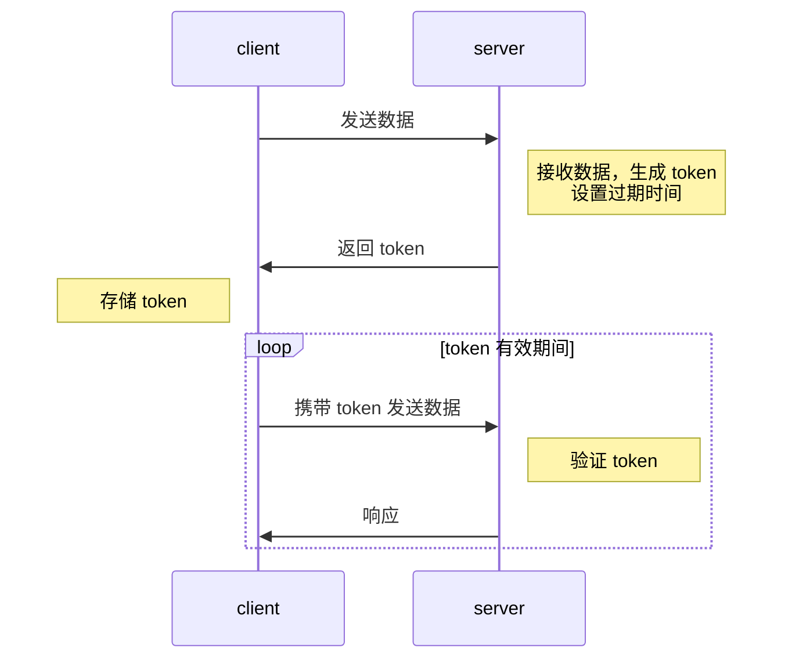
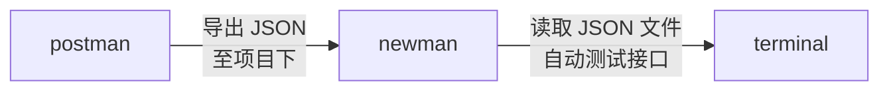
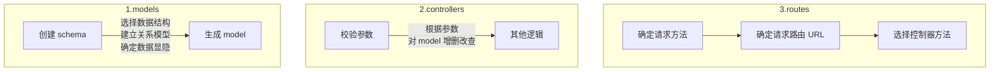

# Koa RESTful API

## 流程

### JWT 流程

### 测试流程

### 接口设计流程

## mermaid 初印象

### 使用体验
目前使用 vscode 写 mermaid，使用 markdown preview mermaid support 提供实时预览，简单体验了流程图、时序图、饼图、甘特图。优点，能够快速完成一些简单的流程图，且基于文本，方便管理版本。缺点：
+ github 不支持 mermaid 预览
+ 没有错误提示，难以定位错误
+ 流程图自动排版效果差，容易出现节点连线歪斜，节点大小各异的情况
+ 编辑体验糟糕。编写过程中，编辑区和预览区均会上下抖动

### 总结
+ mermaid 适合快速出图，结合文字辅助说明一些复杂逻辑，或者单独说明一些简单逻辑
+ 不推荐 mermaid 制作复杂流程图，一旦出错，很难定位
+ 推荐使用 mermain 制作时序图、饼图，两者样式变化少，不会出现流程图歪斜、大小异常的情况，甘特图书写起来文本量太大，也不推荐使用